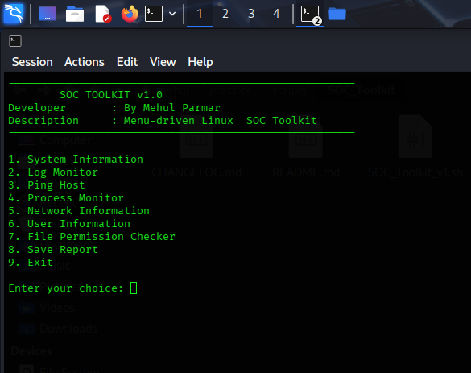

# SOC Toolkit v1.0

A menu-driven Linux SOC Toolkit developed using Bash scripting 

## Developer

Mehul Parmar

## Description

SOC Toolkit is a Bash Scripting project that helps collect useful 
Linux system information and perform basic monitoring tasks from a 
single interactive menu

## Features

- System Information 
- Log Monitor
- Ping Host
- Process Monitor
- Network Information
- User Information
- File Permission Checker 
- Report Generator
- Exit Menu

## Requirements

- Linux (Kali Linux recommended)
- Bash 
- iproute2
- util-linux

## Installation

```bash
git clone https://github.com/mehulparmar35/SOC-Toolkit.git
cd SOC-Toolkit
chmod +x SOC_Toolkit_v1.sh
./SOC_Toolkit_v1.sh
```

## Menu

1. System Information 
2. Log Monitor 
3. Ping Host 
4. Process Monitor
5. Network Information 
6. User Information
7. File Permission Checker
8. Save Report
9. Exit

## Report 

The toolkit can generate a system report in TXT format.

Example:

SOC_Report.txt

## Version 

v1.0.0

## Future Improvements

- DNS Lookup
- Traceroute
- Port Scanner
- WHOIS Lookup
- HTTP Header Checker
- Public IP Finder
- Running Services
- CPU Monitoring 
- Memory Monitoring 
- Disk Monitoring

## Screenshot



## License

MIT License
